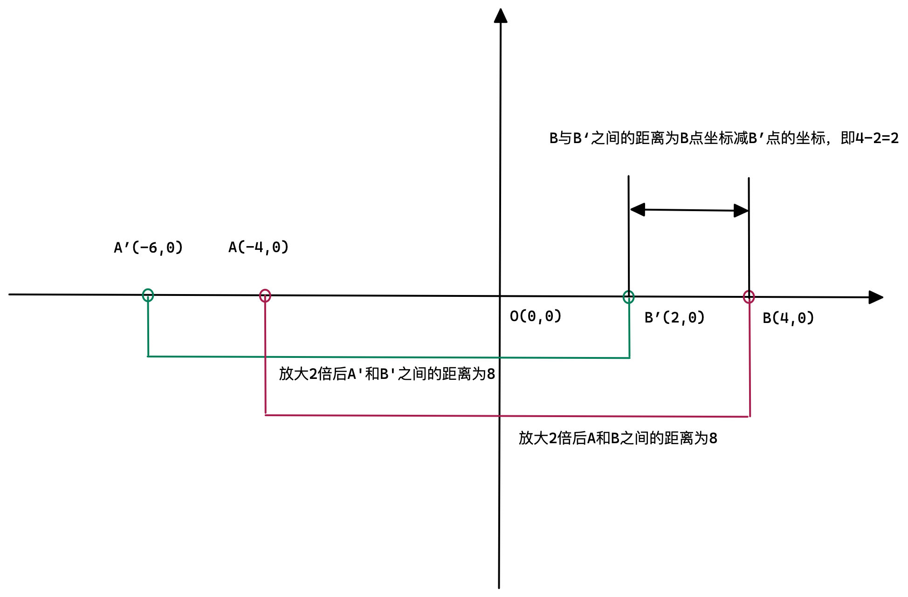

# Canvas实现以鼠标当前位置为原点缩放及画布拖动（矩阵变换）

## 前言

在之前的[Canvas鼠标滚轮缩放以及画布拖动(图文并茂版)](https://juejin.cn/post/7198767799484563516)一文中我曾经介绍过一种实现鼠标滚轮缩放及画布拖动的方法，这种方式利用的是Canvas的api进行缩放和拖动，并且实现原理理解起来也比较抽象。

本文将介绍一种更加便捷、通用的方式来实现鼠标滚轮缩放及画布拖动的方式，这就是**矩阵变换**。

## 矩阵变换

矩阵变换**就是一种坐标系的转换**，因此在图形学中，就会使用矩阵变换来进行图形的变化，比如平移、缩放、旋转。接下来我会重点介绍本文所涉及到的平移和缩放变换。

### 平移

假设有一个点 `P(x, y)`，平移到点 `P'(x1, y1)`，在水平方向位移 `dx`，垂直方向的位移 `dy`，那么就可以得到如下公式：

$$
x1 = x + dx \\
y1 = y + dy
$$
如果将上述变换公式转换为矩阵变换的形式可以得到如下矩阵变换公式:

$$
\left[
\begin{matrix}
  1 & 0 & dx \\
  0 & 1 & dy \\
  0 & 0 & 1
\end{matrix}
\right]
\left[
\begin{matrix}
  x \\ y \\ 1
\end{matrix}
\right]= \left[
\begin{matrix}
  x+dx \\
  y+dy \\
  1 \\
\end{matrix}
\right]
$$

在坐标系中，一个点就相当于一个**向量**，从 `P` 点到 `P'` 点的变换可以通过:

$$
变换矩阵 * P点 = P'点
$$

的形式来表达。

$$
A = \left[
\begin{matrix}
  1 & 0 & dx \\
  0 & 1 & dy \\
  0 & 0 & 1
\end{matrix}
\right]
$$

A矩阵就是平移的变换矩阵。

### 三维矩阵

上面的变换矩阵我们采用的是一个三维矩阵，很多人应该会有疑问：

既然是表达一个二维坐标变换，为什么不用二维矩阵来表达呢？

**答案是：** `二维矩阵无法表达`。

举个例子：

假设我们想把 `(0, 0)` 这个点移动到 `(2, 3)`，如果用二维矩阵来表达，是这样的：

$$
\left[
\begin{matrix}
  1 & 2 \\
  0 & 3 \\
\end{matrix}
\right]
\left[
\begin{matrix}
  0 \\ 0
\end{matrix}
\right]= \left[
\begin{matrix}
  0 \\
  0 \\
\end{matrix}
\right]
$$

发现无论如何也得不到我们想到的结果，因为0与任何数相乘都为0。

如果想表达二维坐标的变换，至少用三维矩阵来表达，同样，如果在三维坐标系中(WebGL)，那么至少需要四维矩阵才能表达。

## 缩放

假设有一个点 `P(x, y)`，沿水平方向缩放 `m` 倍，沿垂直方向缩放 `n` 倍之后，得到点 `P'(x1, y1)`，那么就可以得到如下公式：

$$
x1 = x * m \\
y1 = y * n
$$

如果将上述变换公式转换为矩阵变换的形式可以得到如下矩阵变换公式:

$$
\left[
\begin{matrix}
  m & 0 & 0 \\
  0 & n & 0 \\
  0 & 0 & 1
\end{matrix}
\right]
\left[
\begin{matrix}
  x \\ y \\ 1
\end{matrix}
\right]= \left[
\begin{matrix}
  m*x \\
  n*y \\
  1 \\
\end{matrix}
\right]
$$

从 `P` 点到 `P'` 点的变换可以通过:

$$
变换矩阵 * P点 = P'点
$$

的形式来表达。

$$
A = \left[
\begin{matrix}
  m & 0 & 0 \\
  0 & n & 0 \\
  0 & 0 & 1
\end{matrix}
\right]
$$

A矩阵就是缩放的变换矩阵。

## 平移&缩放

前面我们分别讨论了平移和缩放的场景下，矩阵的变换方式，那如果想要实现本文的目标——以鼠标当前位置为原点缩放，就需要同时用到平移和缩放变换了。

假如一个二维坐标系存在两个坐标点，`A(-2,0)` 和 `B(2,0)`。


如果沿水平方向放大2倍，即 `A` 和 `B` 的水平坐标值都乘以放大系数`2`，得到新的坐标`A'(-4,0)` 和 `B'(4,0)`。


如果想要以`B`点放大中心，确保放大后的`B'`和`B`保持重合，需要将放大后的图形整体向左移动一段距离，距离为 `B` 和 `B‘`之间水平距离，根据数学公式中两点之间的距离公式，`B` 和 `B‘`之间水平距离为 `B‘` 的水平坐标减去 `B` 的水平坐标。

进一步抽象计算公式：

如果 `B(x,0)`，沿水平方向放大 `n` 倍之后，得到 `B’(n*x,0)`，那么两点间的距离为 `n*x-x`，又因为是向左移动，上述距离需要取反，即 `x-n*x`，提取公因式之后得到最终水平方向的偏移值为 `x(1-n)`。此公式同样适用于垂直方向的缩放。




理解了以某一个点进行缩放的原理之后，我们就可以得到以下矩阵变换公式：

$$
\left[
\begin{matrix}
  m & 0 & x(1-m) \\
  0 & m & y(1-m) \\
  0 & 0 & 1
\end{matrix}
\right]
\left[
\begin{matrix}
  x \\ y \\ 1
\end{matrix}
\right]= \left[
\begin{matrix}
  m*x+x(1-m) \\
  m*y+y(1-m) \\
  1 \\
\end{matrix}
\right]
$$

变换矩阵A即为以某一个点进行缩放的变换矩阵。

$$
A=\left[
\begin{matrix}
  m & 0 & x(1-m) \\
  0 & m & y(1-m) \\
  0 & 0 & 1
\end{matrix}
\right]
$$

## glMatrix

在矩阵变换过程中会频繁涉及到矩阵的一些操作，特别是矩阵的乘法，可以使用[glMatrix](https://glmatrix.net/)库，帮助我们简化矩阵的计算过程。

如果计算两个矩阵相乘：

```js
const out = new Float32Array([
  0, 0, 0,
  0, 0, 0, 
  0, 0, 0,
]);

const o = new Float32Array([
  1, 0, 0,
  0, 1, 0,
  0, 0, 1,
]);

const t = new Float32Array([
  3, 0, 0,
  0, 3, 0,
  0, 0, 3,
]);

const nv = mat3.multiply(out, t, o);
```

使用 `glMatrix` 库进行矩阵计算的时候有一点要注意：

> This may lead to some confusion when referencing OpenGL documentation, however, which represents out all matricies in column-major format

`glMatrix` 文档中强调，`glMatrix` 是以列为主的格式。也就是说一个矩阵，在 `glMatrix` 中会变成矩阵的转置进行计算。

$$
A=\left[
\begin{matrix}
  1 & 0 & 0 & 0 \\
  0 & 1 & 0 & 0 \\
  0 & 0 & 1 & 0 \\
  x & y & z & 0 \\
\end{matrix}
\right]
$$

在输入到 glMatrix 中会转换为 A的转置进行计算：

$$
A=\left[
\begin{matrix}
  1 & 0 & 0 & x \\
  0 & 1 & 0 & y \\
  0 & 0 & 1 & z \\
  0 & 0 & 0 & 0 \\
\end{matrix}
\right]
$$

## 代码实现


